#  Heart Disease Risk Analysis and Prediction
 

## Background
Heart disease is a critical health issue affecting millions worldwide. Patient data provides valuable insights into identifying risk factors and predicting outcomes. This project aims to analyze and predict the risk of heart disease using a multiclass classifier, leveraging patient data such as age, blood pressure, cholesterol levels, and other health metrics.

## Exploratory Data Analysis
1. What Happened?

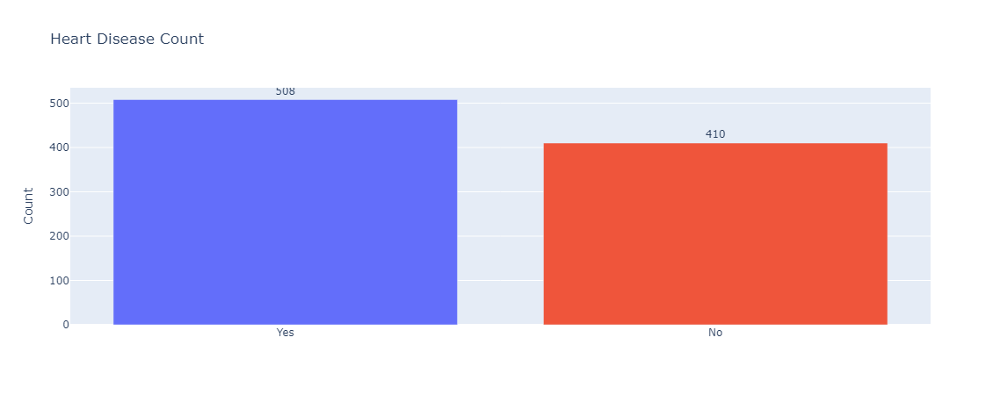
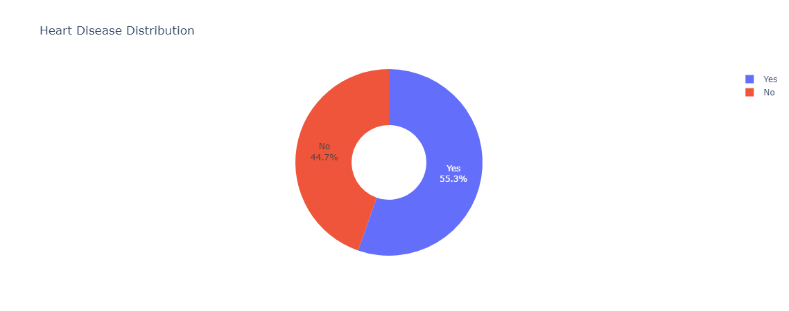

The dataset contains 508 instances (55.3%) labeled as "Heart Disease" and 410 instances (44.7%) labeled as "No Heart Disease."

2. How does the prevalence of heart disease vary by age and gender?

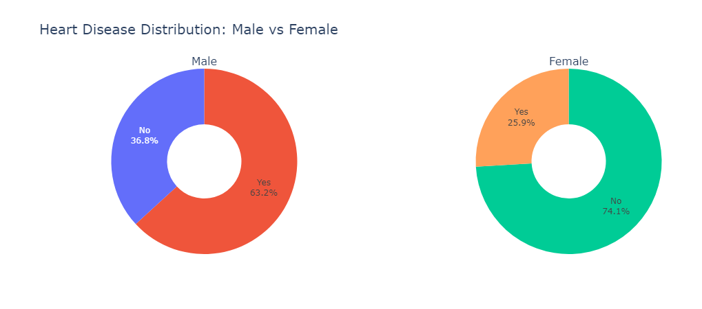

Males typically show a higher prevalence of heart disease compared to females.

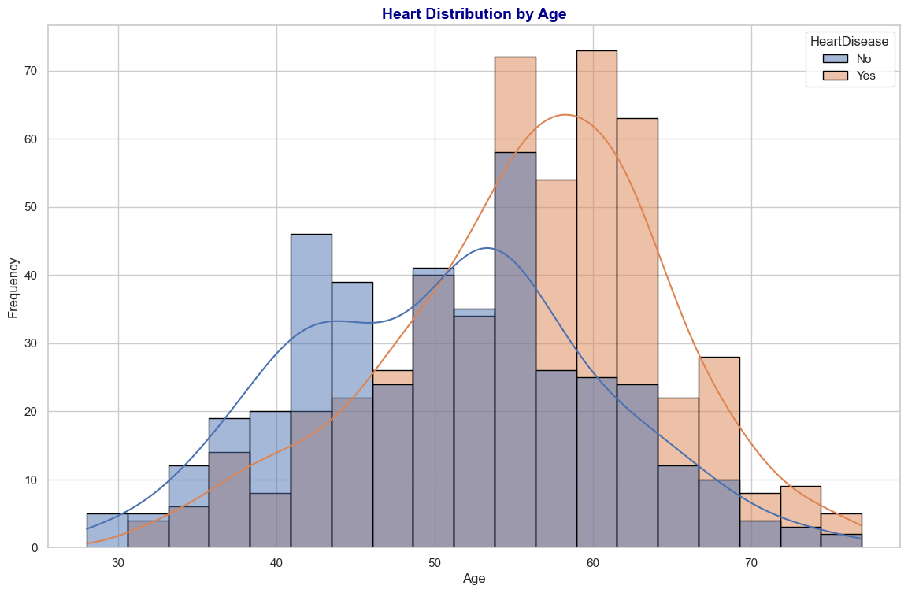

Heart disease is more prevalent among older individuals, with an increasing trend after age 40.

3. What are the most common chest pain types among patients with and without heart disease?

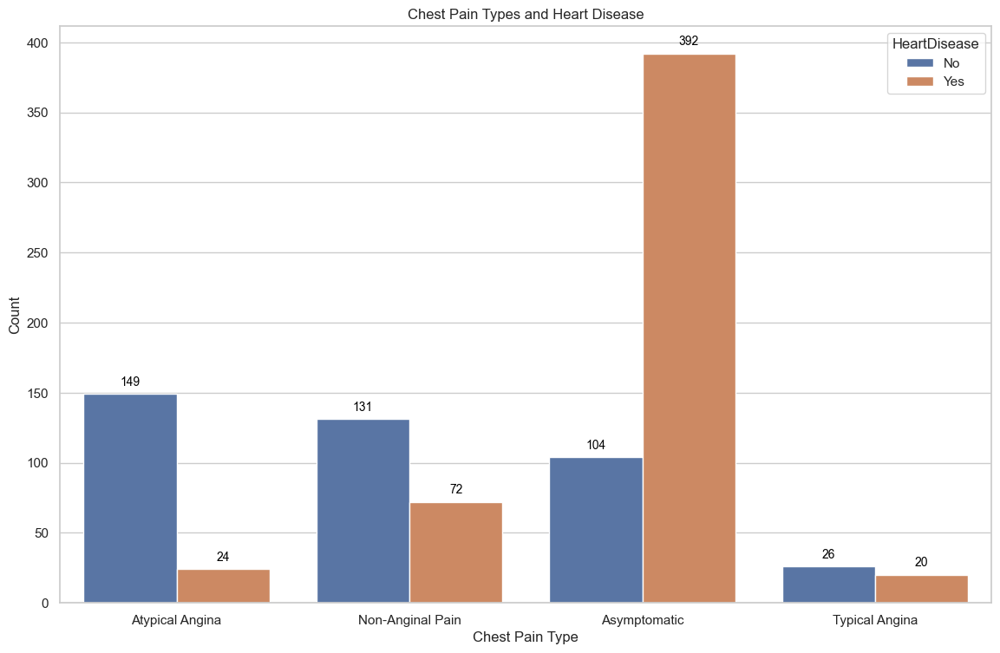

- Patients with atypical angina, non-anginal and Typical angina chest pain tend to have lower rates of heart disease.
- asymptomatic chest pain is often linked with higher heart disease prevalence.

4. What is the relationship between resting blood pressure, cholesterol and heart disease?

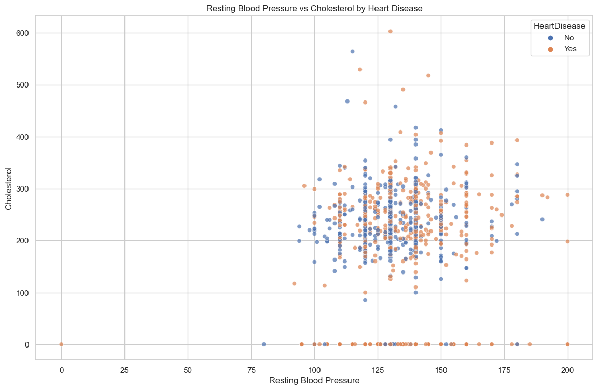

Higher cholesterol and elevated resting blood pressure are associated with a greater likelihood of heart disease, but the relationship may vary depending on other factors like age.

5. How does the maximum heart rate achieved differ between patients with and without ExerciseAngina?

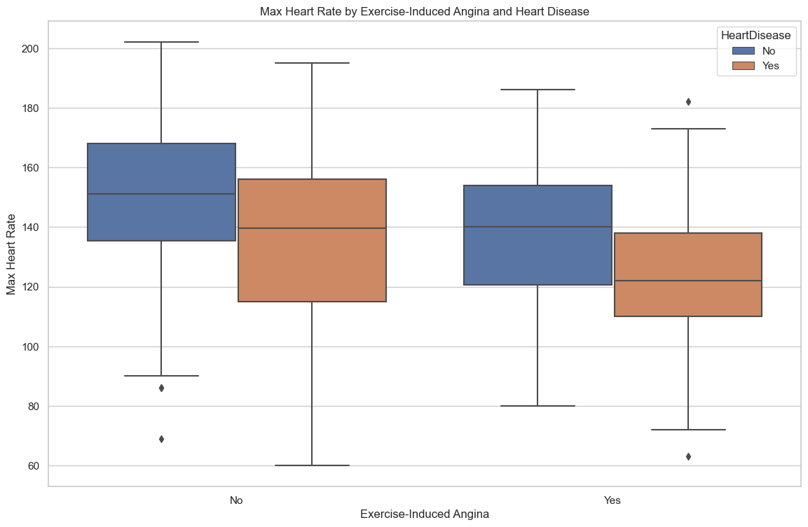

Individuals with heart disease tend to have a lower Max Heart Rate compared to those without heart disease, regardless of whether they experience Exercise-Induced Angina or not.

6. What patterns in resting ECG are associated with heart disease?

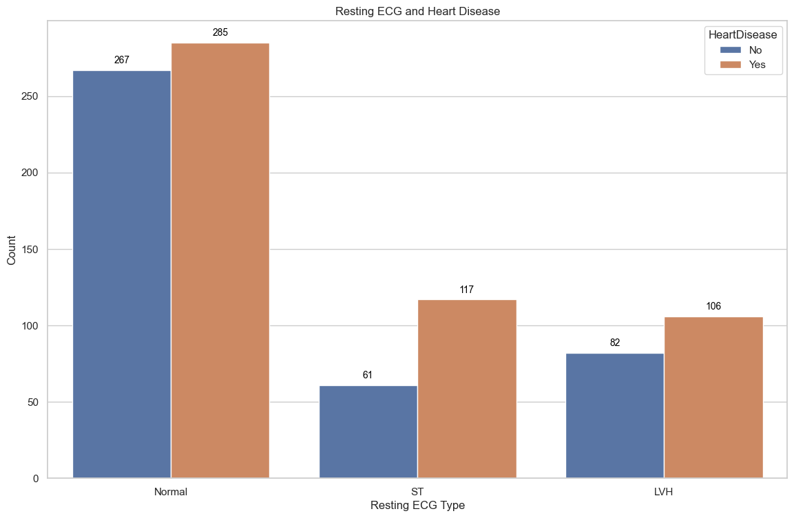

Abnormal resting ECG results are more common in heart disease cases.

7. What patterns in ST segment slope are associated with heart disease?

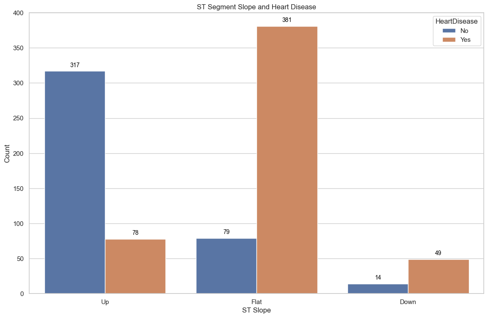

A descending ST segment slope is strongly associated with heart disease.

8. How do age and fasting blood sugar together influence the likelihood of heart disease?

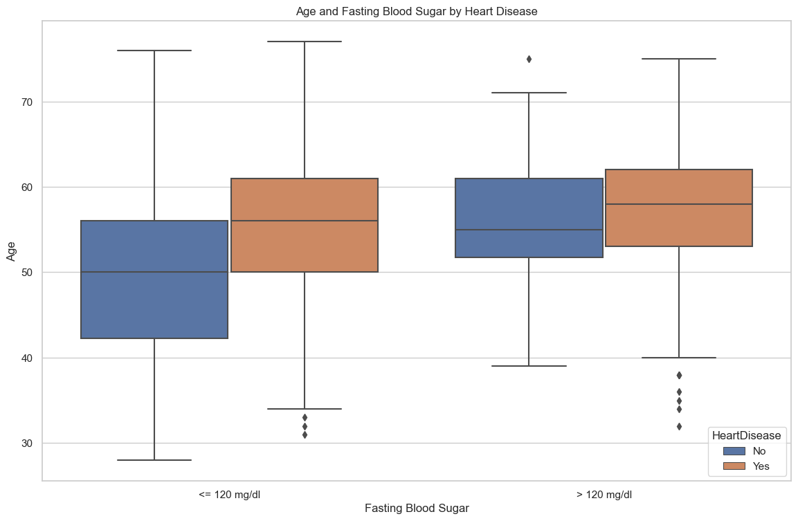

Older individuals with fasting blood sugar > 120 mg/dl have a significantly higher prevalence of heart disease.

9. Are there any notable outliers in Age, RestingBP, Cholesterol, MaxHR, or Oldpeak?

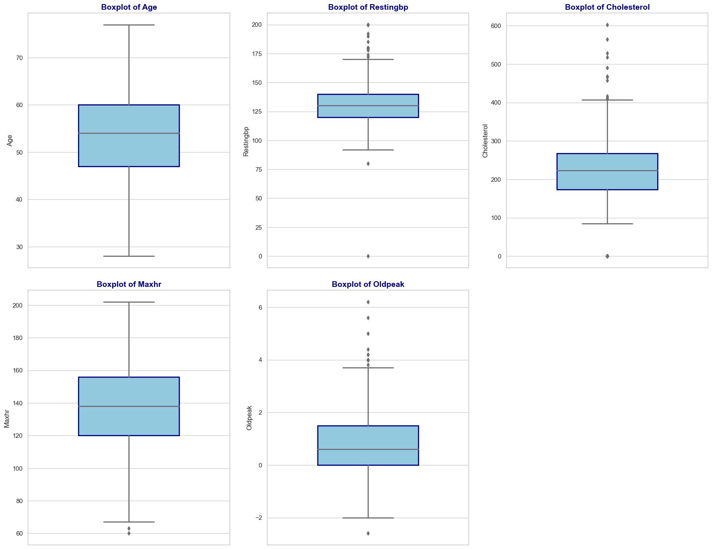

Based on the boxplot, the columns RestingBP, Cholesterol, MaxHR, and Oldpeak contain outliers that should be removed to maintain data quality.

## Feature Extraction
I did Label-Encoder and Standard-Scaler method on feature extraction.

## Oversampling with SMOTE
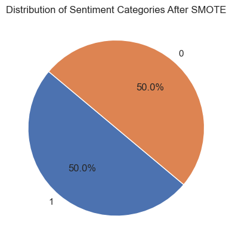

This dataset is imbalanced, I use SMOTE to make it balanced.

## Modeling
I use Random Forest, KNeighborsClassifier (KNN) and Support Vector Machine (SVM) for Model Development.

## Evaluation
- I'm still paying attention to the accuracy score as well since this metric is easier to interpret.
- The model's performance was evaluated using metrics such as precision, recall, and F1-score.
- I'm also using cross validation performance to estimated accuracy score for data validation with 5-folds.
- In modeling, test performance is evaluated using AUC metrics.

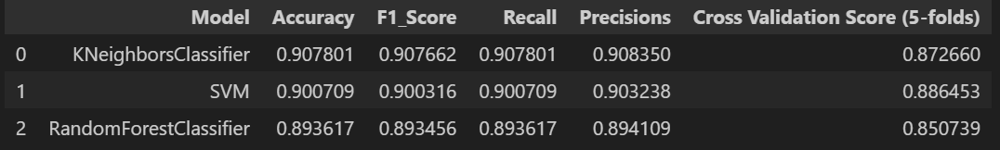

Support Vector Machine (SVM) give the best performance.

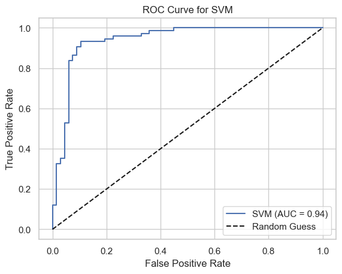

ROC Curve performance reach 0.94 using SVM

## Deployment with Streamlit
To deploy the Streamlit app, I ensured all dependencies were installed, prepared a requirements.txt file, and deployed via Streamlit Sharing, linking a GitHub repository for automated updates.

## Conclusion
SVM is the best model, providing a strong balance with an accuracy of 0.9007, precision of 0.9032, recall of 0.9007, F1-score of 0.9003, and cross-validation performance of 0.8865. Its consistency across folds makes it ideal for predicting new data. The model was tested using the AUC metric, achieving an impressive 0.94, indicating excellent performance.
